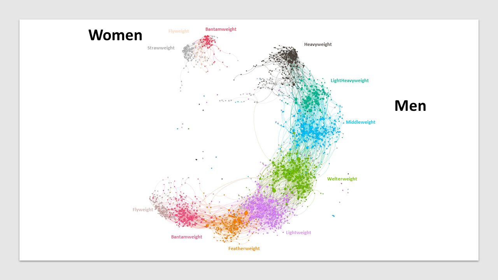

# Data
UFC-Fight historical data from 1993 to 2021 (available at https://www.kaggle.com/datasets/rajeevw/ufcdata)
- Compiled UFC fight, fighter stats and information
- 144 columns and 6K rows with information about fighters characteristics and fight outcome
- each row represents a match

# Techniques used
GNN, GCNN, Gephi, networkx, PageRank, PyG

# Cool things to do
## Node level
- [x] weight class prediction (classification)
- [ ] predict wether a fighter has been a champion (bin. classification, imbalanced)
- [ ] community detection
- [ ] dynamic power ranking / temporal graph

## Edge level
- [ ] predict outcome of matches given all preceding fights

# Visualisation

On the picture above, the size of the node reflects the number of bouts a fighter has participated in. The C shape obtained with Force Atlas is a manifestation of some fighters fighting in different categories hence through attraction making the whole structure fold a bit. You can see some of these cross weight categories fighter if you look carefully. The network of women is logically disconnected from the men's.
